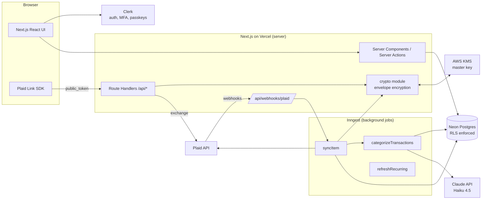
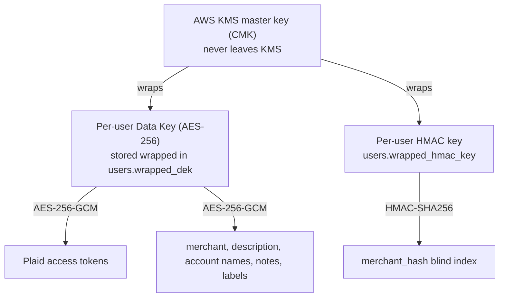
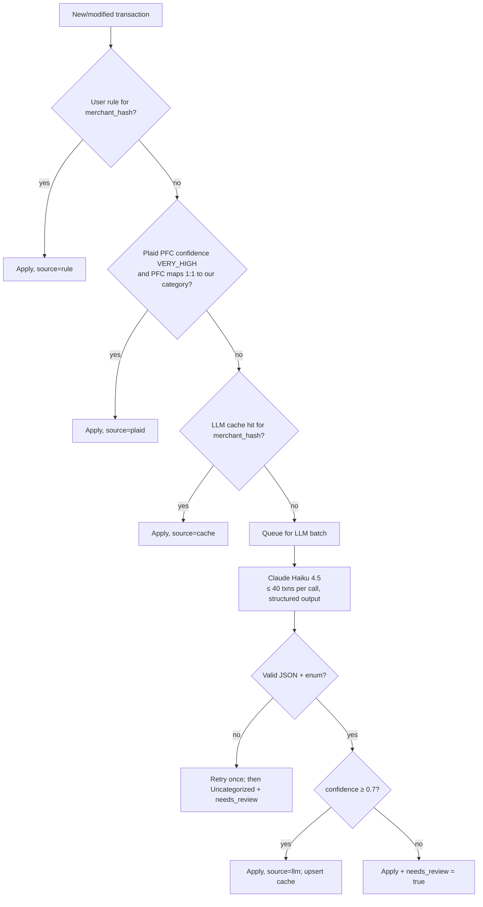

# MoneyFlow: Implementation Plan

App name: **MoneyFlow**, a private, AI-categorized credit card expense tracker built on Next.js and Plaid.

> **A correction to the planning prompt:** Plaid retired its "Development" environment in 2024, and as of April 15, 2026 it no longer offers new US/Canada signups for Limited Production. The rollout path is now **Sandbox (fake data) → Trial plan (free, up to 10 real Items, including OAuth banks like Chase/BofA/Wells) → Full Production (Pay As You Go)**.

---

## 0. The decision that changes everything: personal app or public product?

Settle this before writing code. It changes the compliance burden more than any technical choice does.

| | **Personal / friends & family (≤ ~10 users)** | **Public product** |
|---|---|---|
| Plaid access | Plaid Trial plan is enough (free, up to 10 real Items) | Full Production application, security questionnaire, company info, privacy policy, possibly SOC 2 questions |
| Legal | Minimal | Privacy policy, ToS, data-retention policy, GLBA-style safeguards, CCPA if CA users |
| Design impact | Same architecture | Same architecture, plus audit, support and incident process |

**Decided (2026-09-29): personal app on the Plaid Trial plan (signed up).** Still build it as though it were a public product (the architecture below), but launch it as a personal app on the Plaid Trial plan first. Nothing in this plan needs to be redone to go public later.

---

## 1. Architecture overview



The browser never talks to Plaid except through **Plaid Link**, which is Plaid's own hosted UI where the user logs into their bank. Link hands back a short-lived `public_token`. The Next.js server trades it for an `access_token`, encrypts the token with a per-user key (itself wrapped by an AWS KMS master key), and stores it in Postgres. After that, Plaid **webhooks** tell us when new transactions exist. An Inngest job pulls them with `/transactions/sync`, stores them (sensitive text encrypted, amounts/dates/categories queryable), and queues categorization. Categorization checks the user's rules and merchant cache first and sends only unknowns to Claude Haiku 4.5 in batches. Reports are plain SQL aggregates over the queryable columns. Postgres Row-Level Security guarantees that every query is scoped to one user even if application code has a bug.

**Do we need a separate backend service?** No. Next.js Route Handlers + Server Actions + Inngest functions (which run as Next.js routes) cover everything. Revisit only if sync volume outgrows serverless timeouts, which is unlikely below roughly 10k users.

---

## 2. Tech stack

| Layer | Choice | Why | Alternative |
|---|---|---|---|
| Framework | **Next.js 15 (App Router, TS)** | SSR keeps financial data server-side; Server Actions reduce API boilerplate | Remix |
| Hosting | **Vercel** | Native Next.js, env secret store, cron | Fly.io / AWS Amplify |
| Database | **Neon Postgres** | Serverless Postgres, branching for preview envs, supports RLS | Supabase Postgres |
| ORM | **Drizzle** | SQL-first, first-class RLS/raw SQL support, light on serverless cold starts | Prisma |
| Auth | **Clerk** | MFA + passkeys + Google OAuth out of the box, bot/brute-force protection, session management done right | Supabase Auth (cheaper, fewer vendors, weaker passkey story); Auth.js (most control, most work) |
| Bank data | **Plaid Transactions** (+ Recurring Transactions) | Industry standard; credit cards covered | MX, Teller |
| Background jobs | **Inngest** | Durable steps, retries, per-user concurrency keys, runs inside Next.js | Trigger.dev; QStash + Vercel Cron |
| Key management | **AWS KMS** (one symmetric CMK) | Envelope encryption, audit via CloudTrail, key never leaves HSM | GCP KMS; Vercel env key (weaker, MVP only) |
| LLM | **Claude Haiku 4.5** (`claude-haiku-4-5`) via `@anthropic-ai/sdk` | Cheap and fast classification with structured JSON output; Batch API (50% off) for backfills | Claude Sonnet 5.5 for the low-confidence review pass |
| Validation | **Zod** | Shared schemas for forms, API and LLM output | Valibot |
| UI | **Tailwind + shadcn/ui** | Fast, accessible components | Mantine |
| Charts | **Recharts** (via shadcn charts) | Composable, SSR-friendly | Tremor |
| Rate limiting | **Upstash Redis + @upstash/ratelimit** | Serverless-friendly | Vercel WAF rules |
| Observability | **Sentry** (with PII scrubbing) + Vercel logs | Errors plus traces | Axiom |
| Testing | **Vitest, Playwright** | Unit/integration + E2E | Jest, Cypress |

---

## 3. Data model

Conventions:
- All money is stored as **`bigint` cents**. Plaid returns floats; convert with `Math.round(amount * 100)`.
- **Plaid sign convention is kept:** positive = money out (purchase), negative = money in (refund, payment).
- `*_ct` columns are **ciphertext** (`bytea`, AES-256-GCM with the user's data key). `*_hash` columns are **blind indexes** (HMAC-SHA256 with a per-user key) for exact-match lookups without decrypting.
- Every user-owned table has `user_id` and RLS.

```sql
-- ============ Users & keys ============
create table users (
  id               text primary key,             -- Clerk user id
  email_hash       bytea not null,               -- HMAC, for support lookup only
  wrapped_dek      bytea not null,               -- data key, encrypted by KMS CMK
  wrapped_hmac_key bytea not null,               -- blind-index key, encrypted by KMS CMK
  kms_key_id       text  not null,
  timezone         text  not null default 'America/New_York',
  currency         char(3) not null default 'USD',
  created_at       timestamptz not null default now(),
  deleted_at       timestamptz
);

-- ============ Plaid ============
create table plaid_items (
  id                 uuid primary key default gen_random_uuid(),
  user_id            text not null references users(id) on delete cascade,
  plaid_item_id      text not null unique,
  institution_id     text,
  institution_name   text,                        -- not sensitive
  access_token_ct    bytea not null,              -- ENCRYPTED
  sync_cursor        text,                        -- opaque, not sensitive
  status             text not null default 'active', -- active | login_required | pending_expiration | revoked | error
  last_error_code    text,
  consent_expires_at timestamptz,
  last_synced_at     timestamptz,
  created_at         timestamptz not null default now()
);

create table accounts (
  id               uuid primary key default gen_random_uuid(),
  user_id          text not null references users(id) on delete cascade,
  item_id          uuid not null references plaid_items(id) on delete cascade,
  plaid_account_id text not null unique,
  name_ct          bytea not null,                -- ENCRYPTED ("Sapphire Preferred")
  mask_ct          bytea,                         -- ENCRYPTED (last 4)
  type             text not null,                 -- credit | depository | ...
  subtype          text,
  display_color    text,
  is_hidden        boolean not null default false
);

-- ============ Categories & tags ============
create table categories (
  id              uuid primary key default gen_random_uuid(),
  user_id         text references users(id) on delete cascade, -- NULL = system default
  slug            text not null,                  -- 'groceries', 'streaming'
  name            text not null,
  parent_slug     text,                           -- 'travel' for 'travel_flights'
  kind            text not null,                  -- expense | income | transfer
  counts_as_spend boolean not null,               -- false for transfers & card payments
  icon            text,
  unique (user_id, slug)
);

create table tags (
  id         uuid primary key default gen_random_uuid(),
  user_id    text not null references users(id) on delete cascade,
  name_ct    bytea not null,                      -- ENCRYPTED ("Japan trip 2026")
  starts_on  date,                                -- optional trip window
  ends_on    date,
  kind       text not null default 'custom'       -- custom | trip | project
);

-- ============ Transactions ============
create table transactions (
  id                     uuid primary key default gen_random_uuid(),
  user_id                text not null references users(id) on delete cascade,
  account_id             uuid not null references accounts(id) on delete cascade,
  plaid_transaction_id   text not null unique,
  pending                boolean not null,
  pending_transaction_id text,                    -- links posted -> earlier pending
  date                   date not null,           -- posted date (Plaid, already local)
  authorized_date        date,
  amount_cents           bigint not null,         -- + out, - in
  iso_currency           char(3) not null default 'USD',
  merchant_name_ct       bytea,                   -- ENCRYPTED
  description_ct         bytea not null,          -- ENCRYPTED (raw Plaid "name")
  merchant_hash          bytea,                   -- blind index of normalized merchant
  location_city_ct       bytea,                   -- ENCRYPTED (helps trip detection)
  plaid_pfc_primary      text,                    -- e.g. FOOD_AND_DRINK
  plaid_pfc_detailed     text,                    -- e.g. FOOD_AND_DRINK_GROCERIES
  plaid_pfc_confidence   text,                    -- VERY_HIGH | HIGH | MEDIUM | LOW | UNKNOWN
  category_id            uuid references categories(id),
  category_source        text,                    -- plaid | rule | cache | llm | user
  category_confidence    real,
  needs_review           boolean not null default false,
  recurring_stream_id    uuid,
  notes_ct               bytea,                   -- ENCRYPTED
  created_at             timestamptz not null default now(),
  updated_at             timestamptz not null default now()
);
create index on transactions (user_id, date desc);
create index on transactions (user_id, category_id, date);
create index on transactions (user_id, merchant_hash);
create index on transactions (user_id) where needs_review;

create table transaction_tags (
  transaction_id uuid references transactions(id) on delete cascade,
  tag_id         uuid references tags(id) on delete cascade,
  user_id        text not null references users(id) on delete cascade,
  source         text not null default 'user',    -- user | suggested
  primary key (transaction_id, tag_id)
);

-- Merchant -> category memory. One table for both user rules and the LLM cache.
create table merchant_categories (
  user_id       text not null references users(id) on delete cascade,
  merchant_hash bytea not null,
  category_id   uuid not null references categories(id),
  source        text not null,                    -- 'user' (rule, always wins) | 'llm' (cache)
  confidence    real,
  hit_count     int not null default 0,
  updated_at    timestamptz not null default now(),
  primary key (user_id, merchant_hash)
);

create table recurring_streams (
  id             uuid primary key default gen_random_uuid(),
  user_id        text not null references users(id) on delete cascade,
  plaid_stream_id text unique,
  merchant_hash  bytea,
  merchant_ct    bytea,                           -- ENCRYPTED
  frequency      text,                            -- WEEKLY | MONTHLY | ANNUALLY ...
  avg_amount_cents bigint,
  last_date      date,
  is_active      boolean not null default true,
  category_id    uuid references categories(id)
);

-- ============ Income ============
create table income_sources (          -- recurring income
  id           uuid primary key default gen_random_uuid(),
  user_id      text not null references users(id) on delete cascade,
  label_ct     bytea not null,                    -- ENCRYPTED ("Acme salary")
  amount_cents bigint not null,                   -- net (take-home) per occurrence
  frequency    text not null,                     -- weekly | biweekly | semimonthly | monthly | annually
  anchor_date  date not null,                     -- a known pay date
  end_date     date
);

create table income_entries (          -- one-off income
  id           uuid primary key default gen_random_uuid(),
  user_id      text not null references users(id) on delete cascade,
  label_ct     bytea not null,
  amount_cents bigint not null,
  received_on  date not null
);

-- ============ Ops ============
create table webhook_events (          -- idempotency + debugging (no PII stored)
  id            uuid primary key default gen_random_uuid(),
  plaid_item_id text,
  webhook_type  text, webhook_code text,
  body_sha256   bytea unique,
  received_at   timestamptz not null default now(),
  processed_at  timestamptz
);

create table audit_log (
  id         bigserial primary key,
  user_id    text,
  action     text not null,          -- item.link | item.remove | export | account.delete | rule.create
  ip_hash    bytea,
  meta       jsonb,                  -- never contains ciphertext or tokens
  created_at timestamptz not null default now()
);
```

### Row-Level Security

The app connects as `app_user`. That role does **not** own the tables and has **no `BYPASSRLS`**. Every request runs inside a transaction that sets the user id first.

```sql
alter table transactions enable row level security;
alter table transactions force row level security;

create policy tenant_isolation on transactions
  using      (user_id = current_setting('app.user_id', true))
  with check (user_id = current_setting('app.user_id', true));
-- Repeat for every user-owned table.
-- categories: using (user_id is null or user_id = current_setting('app.user_id', true))
--             with check (user_id = current_setting('app.user_id', true))

-- Webhooks arrive without a user session. This is the ONE narrow escape hatch:
create function owner_of_item(p_plaid_item_id text) returns text
  language sql security definer set search_path = public as
  $$ select user_id from plaid_items where plaid_item_id = p_plaid_item_id $$;
revoke all on function owner_of_item from public;
grant execute on function owner_of_item to app_user;
```

```ts
// lib/db/withUser.ts: the ONLY way app code gets a DB handle
export async function withUser<T>(userId: string, fn: (tx: Tx) => Promise<T>) {
  return db.transaction(async (tx) => {
    await tx.execute(sql`select set_config('app.user_id', ${userId}, true)`);
    return fn(tx);
  });
}
```

An ESLint rule (`no-restricted-imports`) forbids importing the raw `db` anywhere except `withUser.ts` and migrations.

---

## 4. Security design

### Key hierarchy



**Flow:**
1. **Sign-up:** call `KMS.GenerateDataKey` twice to get a plaintext and a wrapped copy of each key. Store only the wrapped copies.
2. **Per request/job:** call `KMS.Decrypt(wrapped_dek)`, then cache the plaintext key in memory for at most 5 minutes, keyed by user id (LRU, never serialized, never logged).
3. **Encrypt a field:** `iv(12B) || ciphertext || tag(16B)`, with AAD = `${table}:${column}:${user_id}`. The AAD prevents ciphertext being copy-pasted across users or columns.
4. **Delete an account:** delete the rows *and* the wrapped keys. Backups still hold ciphertext, but without the key it's unreadable (**crypto-shredding**).
5. **Key rotation:** the CMK rotates yearly (KMS automatic rotation, transparent). DEK rotation is a background job that re-encrypts a user's rows. Offer it on demand, not routinely.

### What stays plaintext, and why

Report queries need `SUM`/`GROUP BY` in SQL, so these stay queryable: `amount_cents`, `date`, `category_id`, `account_id`, `pending`, Plaid category codes. On their own they reveal *how much and when*, not *where or what*. Merchant names, descriptions, account names/masks, locations, notes and income labels are encrypted.

Transaction search by merchant uses an exact-match blind index plus in-memory decrypt-and-filter over the date-bounded page. At personal-finance volumes (a few thousand rows per user per year) this is fast enough.

### Threat model

| Threat | Mitigation |
|---|---|
| DB dump leaked (backup, SQL injection, insider) | Tokens and descriptive fields encrypted; keys live in KMS, not the DB. Attacker sees amounts/dates without context |
| Bug returns another user's data | RLS forced on every table; the `withUser` wrapper is the only DB entry point; tenant-isolation test suite in CI |
| Plaid access token theft | Encrypted at rest, never sent to the client, never logged (Sentry `beforeSend` scrubber + pino redaction) |
| Forged webhook triggering syncs | Verify the `Plaid-Verification` JWT (ES256), `iat` < 5 min, body SHA-256 matches; dedupe by body hash |
| Account takeover | Clerk MFA/passkeys, bot protection, rate-limited sign-in, new-device email alerts; re-auth required for export/delete/disconnect |
| CSRF / XSS | Server Actions include origin checks; strict CSP with nonces; no `dangerouslySetInnerHTML`; SameSite=Lax cookies |
| Data exfiltration via LLM | Minimal payload (no names, account numbers, balances); transactions referenced by short index, not DB id; Anthropic API data is not used for training by default |
| Leaked env secrets | Vercel encrypted env; separate keys per environment; KMS IAM policy restricted to the prod role; secret scanning (GitHub push protection) |
| Dependency compromise | Lockfile, Dependabot, `npm audit` in CI, minimal dependencies in the crypto path (Node `crypto` only) |

**If the database leaks:** the attacker gets per-user rows of `(date, amount, category, card id)` and ciphertext. Without KMS access they cannot recover merchants, descriptions or Plaid tokens. Response: rotate the Plaid secret, invalidate all Items via `/item/access_token/invalidate`, notify users.

### Web hardening checklist
- HSTS preload, TLS only (Vercel default)
- CSP: `default-src 'self'; script-src 'self' 'nonce-…' https://cdn.plaid.com; frame-src https://cdn.plaid.com; connect-src 'self' https://*.clerk.accounts.dev …`
- Zod validation on every Server Action/Route Handler input
- Upstash rate limits: 10/min on link-token creation, 5/hr on export, 60/min on general API
- Audit log entries for link, disconnect, export, delete, rule creation

---

## 5. Plaid flows

### 5a. Connect a card

```mermaid
sequenceDiagram
  participant U as User (browser)
  participant S as Next.js server
  participant P as Plaid
  participant J as Inngest

  U->>S: POST /api/plaid/link-token
  S->>P: /link/token/create {user.client_user_id, products:[transactions],<br/>transactions.days_requested: 730, webhook, account_filters: credit}
  P-->>S: link_token
  S-->>U: link_token
  U->>P: Plaid Link UI (user logs into bank)
  P-->>U: public_token + metadata
  U->>S: POST /api/plaid/exchange {public_token}
  S->>P: /item/public_token/exchange
  P-->>S: access_token, item_id
  S->>S: encrypt(access_token) → plaid_items; fetch /accounts/get → accounts
  S->>J: send "plaid/item.linked"
  S-->>U: 200, show "Importing transactions…"
  P-->>S: webhook SYNC_UPDATES_AVAILABLE (initial_update_complete / historical_update_complete)
  S->>J: send "plaid/sync.requested"
```

Notes:
- `account_filters: { credit: { account_subtypes: ['credit card'] } }` limits v1 to cards. Remove it later to allow checking accounts (see the income auto-detect in v2).
- Before exchanging, check `metadata.institution.institution_id` against the user's existing Items to prevent **duplicate Items** (Plaid bills per Item).
- `days_requested: 730` gets up to 2 years of history, with data availability depending on the institution.

### 5b. Webhook-driven sync

```mermaid
sequenceDiagram
  participant P as Plaid
  participant W as /api/webhooks/plaid
  participant J as Inngest syncItem
  participant DB as Postgres
  participant C as categorize job

  P->>W: POST webhook (Plaid-Verification JWT)
  W->>W: verify JWT + body hash, dedupe
  W->>J: event {plaid_item_id}
  W-->>P: 200 (fast)
  J->>DB: owner_of_item() → user_id; load cursor, decrypt token
  loop until has_more = false
    J->>P: /transactions/sync {cursor, count: 500}
    P-->>J: added, modified, removed, next_cursor
  end
  J->>DB: one transaction: upsert added/modified, delete removed,<br/>carry category from pending → posted, save cursor
  J->>C: event {user_id, transaction_ids needing category}
```

Sync rules:
- **Concurrency key = `plaid_item_id`** in Inngest, so an Item never syncs twice in parallel.
- On `TRANSACTIONS_SYNC_MUTATION_DURING_PAGINATION`, restart the loop from the **original** cursor. Only persist the cursor after all pages have been applied.
- **Pending → posted:** the posted transaction arrives in `added` with `pending_transaction_id`, and the pending one arrives in `removed`. Copy `category_id`, tags and notes from the pending row to the new row, then delete the pending row. This avoids double counting and preserves user edits.
- **Reports exclude pending by default**, with a toggle to include them.
- Fallback: an Inngest cron runs daily and syncs any Item whose `last_synced_at` is more than 24h old (covers missed webhooks).

### 5c. Re-auth (update mode)

| Webhook | Action |
|---|---|
| `ITEM` / `ERROR` with `ITEM_LOGIN_REQUIRED` | `status = login_required`; banner "Reconnect Chase"; button creates a link token **with `access_token`** (update mode); no exchange needed afterwards |
| `ITEM` / `PENDING_EXPIRATION` or `PENDING_DISCONNECT` | `status = pending_expiration`; email + banner 7 days ahead |
| `ITEM` / `USER_PERMISSION_REVOKED` / `USER_ACCOUNT_REVOKED` | `status = revoked`; keep historical data; offer delete |
| `ITEM` / `NEW_ACCOUNTS_AVAILABLE` | Prompt the user to add the new card via update mode with `account_selection_enabled` |
| `TRANSACTIONS` / `RECURRING_TRANSACTIONS_UPDATE` | Trigger `refreshRecurring` |

### 5d. Disconnect

`/item/remove` → delete the `plaid_items` row (cascades to accounts and transactions) → audit log. Always call Plaid first, so we stop being billed.

### 5e. Money semantics (how to avoid double counting)

| Case | Plaid looks like | Our handling |
|---|---|---|
| Purchase | amount > 0 | Spend in its category |
| Refund / return | amount < 0, merchant category | **Stays in the merchant's category**, so it nets against that category's spend |
| Card payment (on the card) | amount < 0, PFC `LOAN_PAYMENTS_CREDIT_CARD_PAYMENT` or `TRANSFER_IN` | Category `Payments & Transfers` (`counts_as_spend = false`) |
| Card payment (from checking, if linked later) | amount > 0 on depository, `LOAN_PAYMENTS_CREDIT_CARD_PAYMENT` | Same non-spend category, so card purchases aren't counted twice |
| Statement credits / rewards | amount < 0, often `INCOME` or `TRANSFER_IN` | Category `Rewards & Credits`, non-spend, shown separately in reports |
| Interest & fees | amount > 0, `BANK_FEES` | `Fees & Interest`, counts as spend |

**Spend for a period** = `SUM(amount_cents)` over non-pending transactions whose category has `counts_as_spend = true`.

---

## 6. AI categorization pipeline



### Default taxonomy (v1)

| slug | Name | counts_as_spend |
|---|---|---|
| groceries | Groceries | ✓ |
| dining | Restaurants & Dining | ✓ |
| coffee | Coffee & Snacks | ✓ |
| bills_utilities | Bills & Utilities | ✓ |
| phone_internet | Phone & Internet | ✓ |
| subscriptions_streaming | Streaming Subscriptions | ✓ |
| subscriptions_software | Software & Apps | ✓ |
| rent_housing | Rent & Housing | ✓ |
| transport_rideshare | Rideshare & Taxi | ✓ |
| transport_gas | Gas & Fuel | ✓ |
| transport_transit | Public Transit & Parking | ✓ |
| travel_flights | Flights | ✓ |
| travel_lodging | Hotels & Lodging | ✓ |
| travel_other | Travel – Other | ✓ |
| shopping_general | Shopping | ✓ |
| shopping_electronics | Electronics | ✓ |
| health_medical | Health & Medical | ✓ |
| fitness | Fitness & Gym | ✓ |
| personal_care | Personal Care | ✓ |
| entertainment | Entertainment & Events | ✓ |
| education | Education | ✓ |
| gifts_donations | Gifts & Donations | ✓ |
| insurance | Insurance | ✓ |
| fees_interest | Fees & Interest | ✓ |
| other | Other | ✓ |
| payments_transfers | Payments & Transfers | ✗ |
| rewards_credits | Rewards & Credits | ✗ |

**Categories vs. tags:** each transaction has exactly **one category** (what kind of spend) and **zero or more tags** (why/context: "Japan trip 2026", "Wedding", "Work – reimbursable"). "Vacation" is a **tag** spanning Flights + Lodging + Dining, not a category. This is what makes "how much did my Japan trip cost?" answerable.

### LLM call (TypeScript)

```ts
// lib/categorize/llm.ts
import Anthropic from "@anthropic-ai/sdk";
import { z } from "zod";
import { zodOutputFormat } from "@anthropic-ai/sdk/helpers/zod";
import { CATEGORY_SLUGS } from "./taxonomy";

const Result = z.object({
  results: z.array(z.object({
    i: z.number().int(),                        // index into the batch, not a DB id
    category: z.enum(CATEGORY_SLUGS),
    confidence: z.number().min(0).max(1),
    is_subscription: z.boolean(),
    travel_hint: z.string().nullable(),         // e.g. "Tokyo" if clearly trip-related
  })),
});

const anthropic = new Anthropic();

export async function categorizeBatch(txns: LlmTxn[], fewShots: FewShot[]) {
  const res = await anthropic.messages.parse({
    model: "claude-haiku-4-5",
    max_tokens: 4096,
    system: [{ type: "text", text: SYSTEM_PROMPT, cache_control: { type: "ephemeral" } }],
    messages: [{ role: "user", content: renderUserMessage(txns, fewShots) }],
    output_config: { format: zodOutputFormat(Result) },
  });
  if (!res.parsed_output) throw new CategorizationParseError(res.stop_reason);
  return res.parsed_output.results;
}
```

**Payload per transaction (data minimization).** Nothing else is sent:
```json
{"i": 3, "merchant": "TST* BLUE BOTTLE", "desc": "TST* BLUE BOTTLE COFFEE SF", "amount": 6.75, "date": "2026-09-14", "plaid": "FOOD_AND_DRINK_COFFEE", "mcc": "5814"}
```

### System prompt

```text
You are a transaction categorizer for a personal expense tracker. You receive a JSON
array of credit card transactions. For each one, choose exactly one category slug
from the list below.

CATEGORIES
groceries — supermarkets, grocery delivery (Instacart, Whole Foods, Trader Joe's)
dining — restaurants, bars, food delivery (DoorDash, Uber Eats)
coffee — coffee shops, bakeries, snack purchases under ~$15
bills_utilities — electricity, water, gas utility, trash
phone_internet — mobile carriers, ISPs
subscriptions_streaming — Netflix, Spotify, Hulu, Disney+, YouTube Premium, Apple TV+, Max
subscriptions_software — SaaS, app stores, cloud storage, AI tools
rent_housing — rent, HOA, property management
transport_rideshare — Uber, Lyft, taxis (NOT Uber Eats)
transport_gas — gas stations, EV charging
transport_transit — transit fares, tolls, parking
travel_flights — airlines, airfare booking
travel_lodging — hotels, Airbnb, VRBO
travel_other — rental cars, travel agencies, foreign transaction purchases clearly on a trip
shopping_general — Amazon, Target, department stores, general retail
shopping_electronics — Apple Store, Best Buy, electronics retailers
health_medical — pharmacies, doctors, dental, vision
fitness — gyms, fitness classes, sports equipment subscriptions
personal_care — salons, barbers, spas, cosmetics
entertainment — movies, concerts, events, games, ticketing
education — tuition, courses, books for study
gifts_donations — charities, gift purchases when obvious
insurance — insurance premiums
fees_interest — card interest, late fees, annual fees, foreign transaction fees
payments_transfers — card payments, autopay, balance transfers, P2P transfers
rewards_credits — statement credits, cashback, rewards redemptions
other — none of the above fits

RULES
1. Amount sign: positive = purchase, negative = refund/credit/payment. A negative
   amount from a merchant (e.g. "AMAZON REFUND") belongs to that merchant's category,
   NOT payments_transfers. Use payments_transfers for negative amounts only when the
   description indicates a payment ("PAYMENT THANK YOU", "AUTOPAY", "ONLINE PMT").
2. The "plaid" field is Plaid's own guess. Trust it when it agrees with the merchant;
   override it when the merchant name clearly indicates otherwise.
3. Set is_subscription=true for fixed-price recurring services (streaming, software,
   gyms, memberships, phone plans), even if you categorize them elsewhere.
4. travel_hint: a city or country name only if the transaction clearly occurred while
   traveling (airline, hotel, or merchant descriptor naming a far-away city). Else null.
5. confidence: 0.9+ when the merchant is unambiguous; 0.5–0.8 when inferring from
   partial descriptors; below 0.5 when guessing.
6. Descriptors are noisy: strip prefixes like "SQ *", "TST*", "PAYPAL *", "SP ",
   store numbers, and city/state suffixes before deciding.
7. Return one result per input, using the same "i". Do not skip any.

USER PREFERENCES
The user message may include examples of how THIS user categorized similar merchants.
Those examples override your defaults.
```

(Pad the static system prompt with ~20 generic worked examples so it passes **Haiku 4.5's 4,096-token minimum for prompt caching**. Below that, caching silently doesn't apply. Put the per-user few-shots in the user message, after the cache breakpoint.)

### Batching, caching, cost

- **Batch size:** 40 transactions per call. The Inngest step debounces for 30s per user so a sync's worth of transactions goes out together.
- **Initial backfill** (up to 2 years ≈ 1–3k transactions per card): use the **Message Batches API** at 50% cost. Results arrive within minutes to hours, and the UI shows "Categorizing…" with Plaid's category as a provisional label.
- **Merchant cache:** most people's spending repeats merchants heavily. Expect 70–85% cache hits after the first month.
- **Per-user few-shots:** the user's 20 most recent manual corrections go into the user message.
- **Cost per 1,000 uncached transactions** (Haiku 4.5 at $1 / $5 per MTok input / output):
  - ~25 calls × (~2.5k input + ~1.6k output tokens) ≈ 62k input + 40k output ≈ **$0.26**
  - With the system prompt cached and ~75% merchant-cache hits: **≈ $0.06–0.10 per 1,000 transactions**
  - Backfill through the Batch API halves that.

### Learning from corrections

When a user changes a category:
1. Update the transaction (`source = user`).
2. Ask inline: **"Always categorize *Blue Bottle* as Coffee?"** [Just this one] [All past & future]
3. If they choose "All", upsert `merchant_categories(source='user')`, re-label past rows with the same `merchant_hash` whose source ≠ `user`, and write an audit entry.
4. The correction becomes a few-shot example for future LLM calls.

### Subscriptions

- Primary: Plaid `/transactions/recurring/get` → `outflow_streams` (merchant, frequency, average amount, is_active). Store in `recurring_streams` and link transactions via `transaction_ids`. Confirm with Plaid that Recurring is enabled for credit accounts on your plan.
- Fallback heuristic: same `merchant_hash`, ≥ 3 occurrences, 26–35 day spacing, amount within ±10%.
- The "Subscriptions" page lists active streams, monthly cost, annualized cost, and "price went up" flags.

### Trips (v2)

A nightly job clusters transactions carrying `travel_hint` or travel categories within a 14-day window. It proposes a tag ("Trip: Tokyo, Sep 3–12") that the user can accept, which then tags all transactions in that window matching the hint or a travel category. The LLM does no clustering; it only supplies `travel_hint`.

---

## 7. Reporting & income

### Income model
- **Recurring** (`income_sources`): take-home amount, frequency, anchor date. The monthly total expands occurrences within the month. Biweekly pay gives 3 paychecks in some months, which is shown accurately rather than averaged.
- **One-off** (`income_entries`): bonus, tax refund, side gig.
- **v2:** if the user links a checking account, detect payroll deposits (PFC `INCOME_WAGES`) and suggest creating an income source.

### Monthly rollup (computed on the fly in v1)

```sql
-- spend per month per category (runs under RLS)
select date_trunc('month', t.date)::date as month,
       c.slug,
       sum(t.amount_cents) as spend_cents
from transactions t
join categories c on c.id = t.category_id
where t.date >= $1 and t.date < $2
  and not t.pending
  and c.counts_as_spend
group by 1, 2
order by 1, 2;
```

Income is expanded in TypeScript (the recurrence math is easier there). Then, per month:
- `net = income − spend`
- `savings_rate = net / income`

**Why not materialized summaries yet:** with indexed `(user_id, date)` and plaintext amounts, a 24-month query over ~5k rows takes milliseconds. Add a `monthly_summaries` table only if p95 exceeds 200ms.

**Dates and timezones:** Plaid `date` is already a calendar date in the account's local context, so months are `date_trunc('month', date)` with no timezone conversion. `authorized_date` is shown in the UI but reporting uses the posted `date`, which is consistent with card statements. **Currency:** v1 filters to USD and shows a badge on non-USD rows. The `iso_currency` column leaves room for FX later.

### Report screen contents

| Widget | Chart |
|---|---|
| KPI row: Spend, Income, Net, Savings rate for the range + Δ vs. prior period | Stat tiles |
| Monthly spend vs. income, net line | Grouped bar + line (Recharts `ComposedChart`) |
| Spend by category | Horizontal bar (sorted) with drill-down to transactions |
| Category trend | Small multiples / sparklines for the top 6 categories |
| Spend by card | Stacked bar per month |
| Top merchants, largest transactions | Tables |
| Subscriptions total | Stat + list |

**Range selector:** 1M / 3M / 6M / 12M / YTD / Custom. All of these are URL search params, so views can be bookmarked.

---

## 8. API surface

Mutations use Server Actions; data needed by client components and external callers uses Route Handlers. Everything requires a Clerk session unless marked otherwise.

| Kind | Name / path | Purpose |
|---|---|---|
| POST | `/api/plaid/link-token` | Create a link token (optional `itemId` for update mode). Rate limited |
| POST | `/api/plaid/exchange` | Exchange `public_token`, store the encrypted token, fetch accounts, fire the sync event |
| POST | `/api/webhooks/plaid` | **No session.** Plaid JWT verification. Enqueues events |
| POST | `/api/webhooks/clerk` | **No session.** Svix signature. `user.created` → create keys; `user.deleted` → crypto-shred |
| GET/POST | `/api/inngest` | **Inngest signing key.** Job endpoint |
| Action | `removeItem(itemId)` | `/item/remove` + delete. Requires recent re-auth |
| Action | `resyncItem(itemId)` | Manual "refresh now" (rate limited 1/5 min) |
| Action | `updateTransaction(id, {categoryId?, tagIds?, notes?})` | Edit a transaction |
| Action | `createMerchantRule(transactionId, categoryId, applyToPast)` | "Always categorize…" |
| Action | `createTag / updateTag / deleteTag` | Tag CRUD |
| Action | `upsertIncomeSource / deleteIncomeSource` | Recurring income |
| Action | `addIncomeEntry / deleteIncomeEntry` | One-off income |
| GET | `/api/transactions?from&to&account&category&tag&q&cursor` | Paginated list (decrypts server-side) |
| GET | `/api/reports/summary?from&to` | KPI + monthly series |
| GET | `/api/reports/categories?from&to` | Category breakdown |
| POST | `/api/export` | Export all of the user's data as a zip (CSV + JSON), streamed. Re-auth + rate limit + audit |
| Action | `deleteMyAccount()` | Remove all Plaid Items, delete rows and keys, delete the Clerk user. Re-auth + typed confirmation |

---

## 9. Pages & UX

```
/                       Marketing / sign-in
/onboarding             1. Welcome & privacy explainer  2. Connect first card (Plaid Link)
                        3. Add income (skippable)       4. "Importing…" progress → dashboard
/dashboard              This month: spend vs. income, net, top categories, recent transactions,
                        needs-review count, reconnect banners
/transactions           Filterable table (date, card, category, tag, search). Inline category
                        dropdown. Multi-select → bulk tag. Needs-review queue tab
/transactions/[id]      Drawer: details, category, tags, notes, "always categorize" rule
/reports                Range selector + widgets from §7
/subscriptions          Active recurring charges, monthly/annual totals, price-change flags
/income                 Recurring sources + one-off entries, monthly projection
/tags                   Tags and trips with totals ("Japan 2026: $4,812")
/settings/accounts      Connected cards, status, reconnect, disconnect
/settings/categories    Custom categories, merchant rules list (edit/delete)
/settings/security      MFA/passkeys (Clerk UserProfile), sessions, audit log view
/settings/data          Export, delete account
```

UX details that matter:
- Show a **"Pending"** chip on pending transactions. Pending amounts are hidden from totals unless toggled on.
- Low-confidence categories get a subtle dot, and the needs-review count appears as a badge in the nav.
- Every chart segment links to the filtered transaction list.
- Mobile-first layout, since most checking happens on phones. Add a PWA manifest in v2.

---

## 10. Project structure

```
moneyflow/
├─ app/
│  ├─ (marketing)/page.tsx
│  ├─ (app)/layout.tsx              # auth gate, nav
│  ├─ (app)/dashboard/page.tsx
│  ├─ (app)/transactions/…
│  ├─ (app)/reports/…
│  ├─ (app)/subscriptions/…
│  ├─ (app)/income/…
│  ├─ (app)/tags/…
│  ├─ (app)/settings/…
│  ├─ onboarding/…
│  └─ api/
│     ├─ plaid/link-token/route.ts
│     ├─ plaid/exchange/route.ts
│     ├─ webhooks/plaid/route.ts
│     ├─ webhooks/clerk/route.ts
│     ├─ inngest/route.ts
│     ├─ transactions/route.ts
│     ├─ reports/…/route.ts
│     └─ export/route.ts
├─ actions/                          # Server Actions ('use server')
├─ components/                       # ui/ (shadcn), charts/, plaid/PlaidLinkButton.tsx
├─ lib/
│  ├─ db/{schema.ts, withUser.ts, client.ts}
│  ├─ crypto/{kms.ts, envelope.ts, blindIndex.ts, keyCache.ts}
│  ├─ plaid/{client.ts, sync.ts, webhookVerify.ts, pfcMap.ts}
│  ├─ categorize/{pipeline.ts, llm.ts, taxonomy.ts, normalizeMerchant.ts, prompt.ts}
│  ├─ reports/{spend.ts, income.ts, periods.ts}
│  ├─ auth.ts, ratelimit.ts, audit.ts, logger.ts
├─ inngest/{client.ts, syncItem.ts, categorize.ts, refreshRecurring.ts, dailySweep.ts}
├─ drizzle/                          # migrations incl. RLS policies & seed categories
├─ tests/{unit, integration, isolation, e2e}
├─ middleware.ts                     # Clerk + CSP nonce
└─ .env.example
```

---

## 11. Environment variables & accounts

| Var | Where from |
|---|---|
| `DATABASE_URL` (app_user role), `DATABASE_URL_MIGRATOR` (owner) | Neon: create two roles |
| `NEXT_PUBLIC_CLERK_PUBLISHABLE_KEY`, `CLERK_SECRET_KEY`, `CLERK_WEBHOOK_SECRET` | Clerk dashboard |
| `PLAID_CLIENT_ID`, `PLAID_SECRET`, `PLAID_ENV` (`sandbox` / `production`), `PLAID_WEBHOOK_URL` | Plaid dashboard (secret differs per env) |
| `AWS_REGION`, `KMS_KEY_ID`, AWS credentials via **Vercel OIDC → IAM role** (no long-lived keys) | AWS: CMK with key policy allowing only that role `GenerateDataKey`/`Decrypt` |
| `ANTHROPIC_API_KEY` | Claude Console (a workspace dedicated to this app, with a spend limit) |
| `INNGEST_EVENT_KEY`, `INNGEST_SIGNING_KEY` | Inngest (Vercel integration sets these) |
| `UPSTASH_REDIS_REST_URL`, `UPSTASH_REDIS_REST_TOKEN` | Upstash |
| `SENTRY_DSN` | Sentry |

Setup order: Neon → Clerk → Plaid Sandbox → AWS KMS (local dev can use a `LOCAL_MASTER_KEY` fallback behind `NODE_ENV !== 'production'`) → Anthropic → Inngest → Vercel.

---

## 12. Roadmap

### Phase 0: Foundations (week 1)
- [ ] Scaffold Next.js + Tailwind + shadcn + Drizzle + Clerk
- [ ] Schema + migrations + **RLS policies** + `withUser` + lint rule
- [ ] Crypto module (KMS envelope, AES-GCM with AAD, blind index) + unit tests
- [ ] Clerk webhook → user row with wrapped keys
- [ ] **Tenant-isolation test suite** (runs in CI from day one)

### Phase 1: MVP on Plaid Sandbox (weeks 2–3)
- [ ] Link token + exchange + accounts fetch
- [ ] Webhook verification + Inngest `syncItem` with full added/modified/removed/pending handling
- [ ] Transactions page (list, filters, decrypt server-side)
- [ ] Categorization pipeline: rules → Plaid PFC → cache → Haiku batch; needs-review queue
- [ ] Manual re-categorize + "always categorize" rules
- [ ] Basic dashboard (this month by category)
- **Exit criteria:** a Sandbox user (`user_good` / `pass_good`) links a card, sees categorized transactions, fixes one, and the fix sticks for future transactions from that merchant

### Phase 2: v1 on real cards (weeks 4–6)
- [ ] Income sources + entries
- [ ] Reports page (all widgets in §7), range selector, prior-period comparison
- [ ] Subscriptions page (Plaid recurring + heuristic)
- [ ] Tags + bulk tagging
- [ ] Update-mode re-auth flows + banners + email
- [ ] Export, disconnect, delete account (crypto-shred)
- [ ] CSP, rate limits, Sentry scrubbing, audit log UI
- [ ] Batch-API backfill for new Items
- [ ] **Sign up for the Plaid Trial plan (then apply for Full Production if going public)**; privacy policy + ToS pages
- **Exit criteria:** you use it on your own cards for 30 days, and reported monthly spend reconciles with your card statements within $1

### Phase 3: v2 (after that)
- [ ] Budgets per category + alerts (email/push)
- [ ] Trip auto-detection + trip tags
- [ ] Checking accounts: payroll detection → income suggestions; transfer de-duplication
- [ ] PWA + push notifications
- [ ] Full Production Plaid if opening to the public; consider SOC 2-lite controls
- [ ] Monthly email digest ("You spent $X, net +$Y")

---

## 13. Testing strategy

| Layer | What | Tool |
|---|---|---|
| Unit | Envelope encrypt/decrypt round-trip, AAD mismatch fails, blind-index determinism; merchant normalization; PFC → category mapping; income recurrence expansion (biweekly 3-paycheck months, month ends, leap years); spend math (refunds net, payments excluded, pending excluded) | Vitest |
| LLM contract | Zod schema rejects bad enums; fallback on parse failure; **golden set of ~200 labeled real-world descriptors** scored for accuracy (run on prompt changes, target ≥ 92%) | Vitest + recorded fixtures |
| Integration | Plaid Sandbox end to end: link → `/sandbox/item/fire_webhook` → sync → pending→posted carry-over (`user_transactions_dynamic` test user); `TRANSACTIONS_SYNC_MUTATION_DURING_PAGINATION` restart | Vitest against Neon branch |
| **Tenant isolation** | Seed users A and B; for **every** table and **every** read endpoint/action, assert A cannot read or write B's rows, including direct SQL as `app_user` without `set_config` (must return 0 rows) | Vitest, runs in CI and blocks merges |
| Security | Webhook with bad signature / stale `iat` / replayed body is rejected; CSRF on actions; rate limits; logs contain no tokens (grep test over captured logs) | Vitest + ZAP baseline scan |
| E2E | Sign up → onboarding → link Sandbox card → recategorize → report shows the change → export → delete account | Playwright |

---

## 14. Cost estimate (monthly, rough)

Assumptions: 2.5 cards per user, ~120 transactions per user per month, 75% categorization cache hit rate after month one.

| Item | 1 user | 100 users | 1,000 users |
|---|---|---|---|
| Vercel | $0 (Hobby) | $20 (Pro) | $20–50 |
| Neon Postgres | $0 | $19 | $69 |
| Clerk | $0 | $0 | $0–25 (check current free-tier MAU limit) |
| Inngest | $0 | $0 | $0–50 |
| Upstash, Sentry | $0 | $0–26 | $26–50 |
| AWS KMS | ~$1 | ~$1–2 | ~$3–5 (1 key + requests; key cache keeps calls low) |
| Claude Haiku 4.5 | < $0.05 | ~$1–3 | ~$10–30 |
| **Plaid Transactions** | Free on the Trial plan (≤ 10 Items); else ~$0.30/Item/mo | ~$75 (250 Items × $0.30) | ~$750 (2,500 Items × $0.30); the dominant cost |
| **Total excluding Plaid** | **≈ $1** | **≈ $45–75** | **≈ $150–300** |

Plaid pricing isn't published and depends on your contract. Model it as `items × per-item monthly fee`. At 1,000 users × 2.5 Items, even a small per-Item fee dominates everything else in this table. That is the number to get before any public launch.

---

## 15. Open questions & risks

1. **Personal or public?** (§0) This determines the Plaid tier, legal work and timeline.
2. **Plaid approval** can take weeks for Full Production and requires company details. Start the application at the beginning of Phase 2.
3. **Plaid cost per Item.** Get a quote early. It may justify limiting free users to N cards.
4. **Institution coverage/quality:** some issuers (notably some Amex/Apple Card connections) behave differently or need OAuth flows. Test your own cards on the Trial plan early.
5. **LLM accuracy on cryptic descriptors** ("SQ *JMK LLC"). The needs-review queue plus rules covers the gap. Measure with the golden set.
6. **Encrypted-field search** is exact-match or in-memory only. Fine for personal scale, and this should be a conscious product limit.
7. **Anthropic data handling:** API inputs aren't used for training by default. If you go public, review Anthropic's commercial terms and data-retention options and disclose the LLM sub-processor in your privacy policy.
8. **Account recovery vs. encryption:** keys are server-held (KMS), so password resets never lose data. The trade-off is that the operator could technically decrypt. True end-to-end encryption (user-held keys) would break server-side sync and categorization, so it's intentionally out of scope.
9. **Multi-currency and foreign transactions:** deferred. USD only in v1.
10. **Shared/household accounts:** the same card linked by two users means two Items and double billing. Out of scope for v1; a household feature would need a sharing model.
